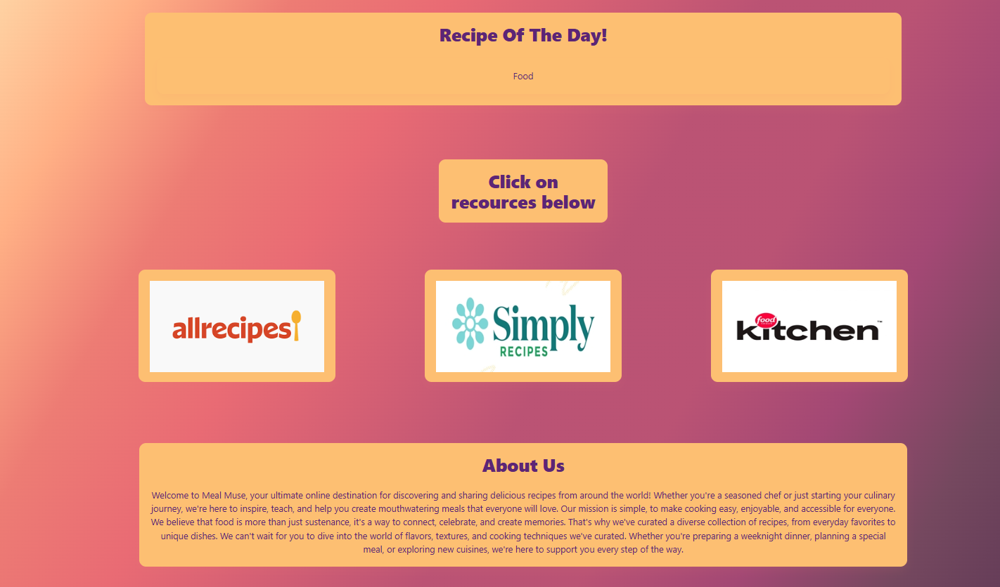

  
  <h1>MEAL MUSE</h1>
  
  

                <h2> Don't let your hunger strike!</h2>
  

##  About the Project

 
  

##  Getting Started
About
Meal Muse is a meal planning website to help combat meal planning fatigue. We offer  month to month planning, a recipe inventory and helpful to links to discover more! 

### Prerequisites

1. Working internet
2. Hunger
3. The ability to tolerate cooking
4. Willingness to attempt cooking
5. Actually putting repieces in the libary. 

### Installing + Executing

* just copy and paste the link into the address bar.

                    OR

* click on the link in DEPLOYMENT.

##  Deployment

You access this website through the link provided below. 

    Live: https://alexis-menendez.github.io/Meal-Muse/
    Release: 1/16/2025
    Development: We are always looking for ways to improve and add new features! 
   
## Usage

Meal Muse is an application in order to store your preferred recipies and add them to a calendar for meal planning purposes. 

### Branches

 Main Branch
 * where all branches merge into.

 Calendar 2.0 + Calendar
 * Responsible for creating and debugging the calendar.
 * adding meals onto the calendar

Recipe Creation
 * Adding in custom recipies w/ name, ingredients and steps.

Recipe libray
* Also known as Inventory, where the recipies will be stored.

Landing
 * Home page

 Testing
 * debugging the repo as a whole.

## Future Development Goals
* Label meals: Breakfast,  Lunch, Dinner, Desert, Snack, etc. 
* Create sections for each label
* Ability to add picture of recipie
* Generating recipies based on inputted ingredients.
* Possible expanion into grocery shopping lists and mindfulness applications surrounding food.
* User generate and submission of cooking videos hosted on MM.
* About/Contact & FAQ pages for simple trouble shooting.
* Forum/recipie exchange page.

##  Additional Documentation and Acknowledgments

   A huge thanks to:
   Our TAs and Tutors
   Copilot + Github
   All the websites who helped build out code.

## USER STORY:

AS A USER who wants to simplify meal planning and recipe organization,
I WANT an app that allows me to save, edit, and plan meals using an interactive calendar and recipe inventory,
SO I CAN reduce decision fatigue and easily access my favorite recipes for month-to-month planning.

## ACCEPTANCE CRITERIA:

1. Recipe Creation and Editing:
  * GIVEN I want to add my custom recipes,
  * WHEN I click on "Add Recipe" or "Edit Recipe,"
  * THEN a modal opens where I can input or modify recipe details (name, ingredients, preparation steps),
  * AND upon saving, the recipe is added to or updated in my recipe library.

2. Drag-and-Drop Meal Planning:
  * GIVEN I want to plan my meals on a monthly basis,
  * WHEN I view the meal planning calendar,
  * THEN I can drag recipes from my recipe inventory onto specific calendar days.

3. Persistent Data Storage:
  * GIVEN I want to retain my meal plans and recipes,
  * WHEN I close and reopen the app,
  * THEN my saved data is still accessible from local storage.

4. Recipe Organization:
  * GIVEN I want to categorize my meals,
  * WHEN I add a recipe,
  * THEN I can label it as Breakfast, Lunch, Dinner, Dessert, or Snack,
  * AND it will be stored under the respective category for easy retrieval.

5. Responsive Design:
  * GIVEN I access the app from different devices (desktop, tablet, mobile),
  * WHEN I view my recipe inventory or meal planner,
  * THEN the layout adjusts for an optimal user experience.
